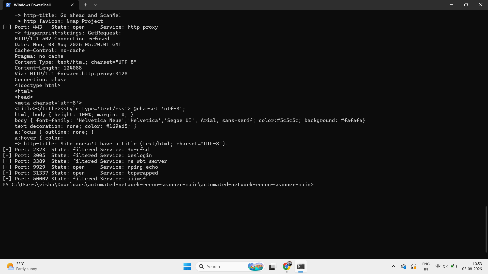

# 🚀 Automated Network Reconnaissance & Nmap Scanner

A powerful **Python-based Network Reconnaissance Tool** that automates the initial phase of penetration testing using **Nmap**. The scanner performs host discovery, port scanning, service enumeration, version detection, and executes default NSE scripts to gather valuable information about the target.

---

## 📌 Overview

This project is designed to simplify and automate network reconnaissance for security professionals, penetration testers, and cybersecurity students. It integrates the **python-nmap** library with the Nmap engine to perform fast and comprehensive scans while presenting the results in a clean and readable format.

---

## ✨ Features

- 🚀 Fast TCP Port Scanning using **Nmap (-T4)**
- 🔍 Service Detection (`-sV`)
- 📜 Default NSE Script Execution (`-sC`)
- 🌐 Host Discovery & Enumeration
- ⚡ Ping Bypass (`-Pn`)
- 📊 Clean and Structured Console Output
- 💻 Cross Platform Support (Windows & Linux)
- 🔐 Suitable for Reconnaissance Phase of Penetration Testing

---

## 🛠️ Technologies Used

- Python 3.x
- Nmap
- python-nmap Library
- PowerShell / Linux Terminal

---

## 📂 Project Structure

```
Automated-Network-Recon-Scanner/

│── scanner.py
│── README.md
│── requirements.txt
│── LICENSE
└── images/
    └── output.png
```

---

## 📦 Prerequisites

Before running this project, install the following:

### Python

Download and install Python:

https://www.python.org/downloads/

---

### Nmap

Download and install Nmap:

https://nmap.org/download.html

Verify Installation

```bash
nmap --version
```

---

## ⚙️ Installation

### Clone Repository

```bash
git clone https://github.com/vishalkumaryadav1428/automated-network-recon-scanner.git

cd automated-network-recon-scanner
```

### Install Dependencies

```bash
python -m pip install python-nmap
```

---

## 🚀 Usage

Run the scanner

```bash
python scanner.py
```

Enter the target:

```
Enter the target IP or Domain:

scanme.nmap.org
```

---

## 📸 Sample Output



---

## 🔍 Example Scan Result

```
Enter the target IP or Domain:

scanme.nmap.org

Starting Fast & Comprehensive Scan...

Host is Up

PORT      STATE      SERVICE

22/tcp    open       ssh
80/tcp    open       http
443/tcp   open       https
9929/tcp  open       nping-echo
31337/tcp open       tcpwrapped

Scan Completed Successfully
```

---

## 📖 How It Works

1. Accepts Target IP or Domain
2. Launches Nmap Scan
3. Detects Open Ports
4. Identifies Running Services
5. Executes Default NSE Scripts
6. Displays Organized Results

---

## 🎯 Future Improvements

- Export Scan Results to PDF
- Export JSON Reports
- HTML Report Generation
- Multi-threaded Scanning
- GUI Version (Tkinter)
- Scheduled Scans
- Email Notifications
- CVE Lookup Integration
- Vulnerability Detection
- Logging Support

---

## 🎓 Learning Outcomes

This project demonstrates knowledge of:

- Network Reconnaissance
- Python Automation
- Nmap Integration
- TCP/IP Networking
- Service Enumeration
- Penetration Testing Methodology
- Cybersecurity Fundamentals

---

## ⚠️ Disclaimer

This project is intended **strictly for educational purposes and authorized security assessments**.

Do **NOT** scan systems, networks, or devices without obtaining explicit permission from the owner.

The author assumes **no responsibility** for misuse of this tool.

---

## 👨‍💻 Author

**Vishal Kumar Yadav**

🎓 B.Tech CSE (Cyber Security)

📍 Lovely Professional University

🔗 GitHub

https://github.com/vishalkumaryadav1428

---

## ⭐ If you found this project useful

Please consider giving this repository a **⭐ Star** on GitHub.
